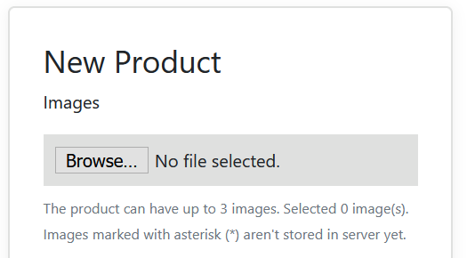

# Shopstore Web App

## Before run

Start [Shopstore Server App](https://github.com/pcs980/shopstore-api). If everything works fine you will this output:

```sh
info: Start consuming queues from localhost:6379
info: Service ready and listening to port 3030
```

And make sure [constant](src/utils/constants.ts) `SERVER_BASE_URL` is setted to service host and port.

## Run

Execute the commands below in inside the project's folder:

```
yarn install
yarn start
```

## User stories

### *As a guest, I want to sign up and sign in to the application*

OK.

### *As a user, I want to confirm my email to start using the application*

OK.

### *As a new user, I need to confirm my email address to start using the application*

OK.

The first screen for new users is the e-mail verification code and the products menu is not shown.


### *As a user, I want to create a product with at least these fields: name, description, price and published_at*

OK.

The published at field automatically filled on saving.


### *As a user, I want to upload one or more images to the product*

The default limit is 3 images, but you can define a different limit by setting `MAX_PRODUCT_IMAGES` in [constants file](src/utils/constants.ts).



### *As a user, I want to list all the products I've created*

OK.


### *As a user, I want to update and soft deletes a product*

OK.

I understood that **soft delete feature** can be achieved by setting the field **Active**, so the user can decide if the product should not be shown to customers, for example.


